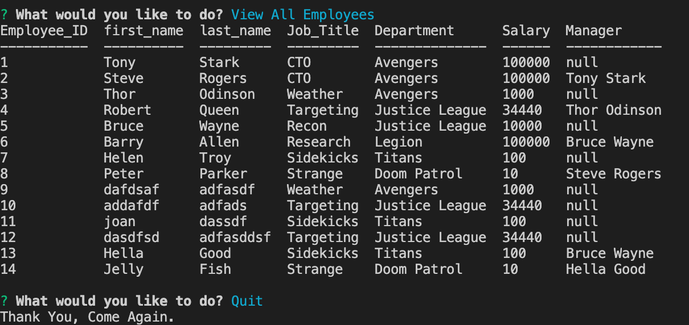

# Employee Tracker

## Description

This Employee Tracker is packed with functionalities.
The User can View Departments, Roles and Employees. 
The User can also Add Departments, Roles and Employees.
The user can Update the role for an Employee as well.
    

## Table of Contents
* [Usage](#usage)
* [WalkThrough Video](#walkthrough)
* [Screenshot](#screenshot)
* [Contributing](#contributing)
* [Tests](#tests)
* [Questions](#questions)

## Usage
npm start

### WalkThrough

<https://drive.google.com/file/d/1iYd7g_RKyk5Rk4LLQsxxGQ23590Xc7cw/view?usp=sharing>

### Screenshot

## Contributing

Please contribute safely
    

## Tests

Please take a look at the repository, 
there you will find the db/seeds.sql file which has the test data
    

## Questions
### Where is my GitHub repository for this project?
[GitHub](https://github.com/chattean/employee-tracker)

### How to get in Contact with me if you have additional questions?

anujchatterjee@gmail.com
    

